# <!--fit--><!-- _class: lead white -->the homeserver talk


---

# `whoami`

- Nemo
- [@captn3m0](https://twitter.com/captn3m0)
- [@razorpay](https://razorpay.com) (:money_with_wings: :credit_card:)
- me@captnemo.in

---

# agenda

0.  What counts as a homeserver?
1.  Why you should run one?
1.  How do you get started?
1.  All the gotchas!
1.  CTA

---

# homeserver

A _computer_ which runs service(s) for personal use.

---


---

# motivation?

1.  owning your data

---

# motivation?

1.  owning your data
2.  de-googling

---

# motivation?

1.  owning your data
2.  de-googling
3.  backing up your data locally

---

# motivation?

1.  owning your data
2.  de-googling
3.  backing up your data locally
4.  learning/experimenting with tech

---

# motivation?

1.  owning your data
2.  de-googling
3.  backing up your data locally
4.  learning/experimenting with tech
5.  playing mario

---

# <!-- _class: lead --> 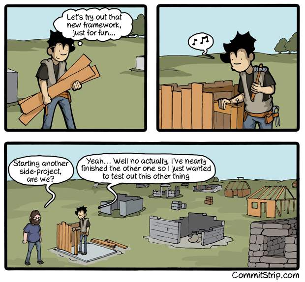

---

# time?

_<5 hr a month_

---

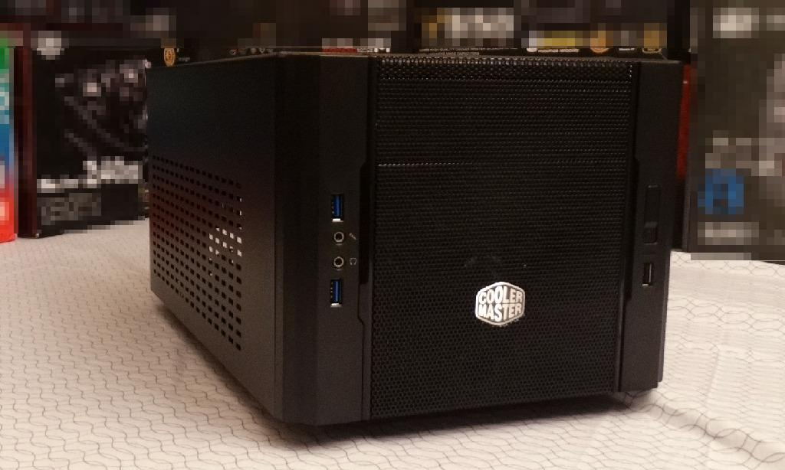

---

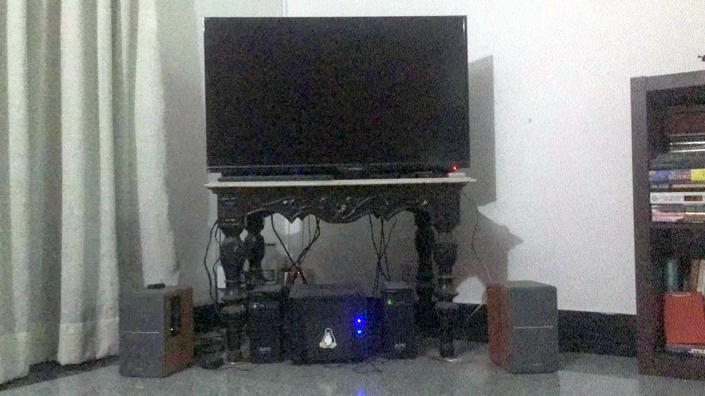

---


---

# what I run?

## Monitoring

- Prometheus
- Grafana
- speedtest-exporter
- [ACT Exporter](https://git.captnemo.in/nemo/prometheus-act-exporter)
- CAdvisor

---

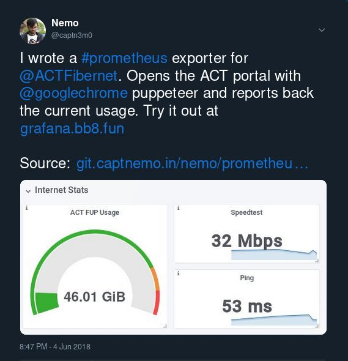

---

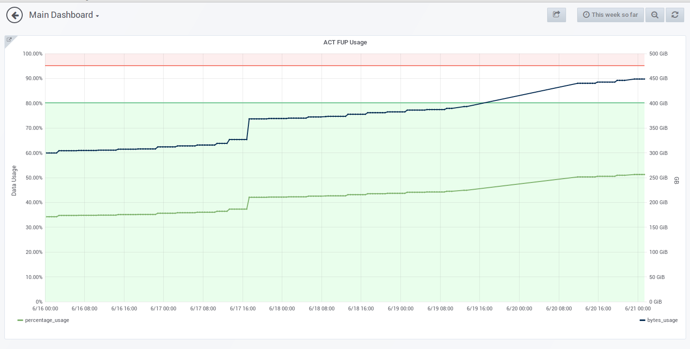

<!-- _class: bottom --> [#](https://grafana.bb8.fun/d/_u2-GHSik/main-dashboard?orgId=1&fullscreen&panelId=3&from=now%2Fw&to=now)

---

## Media

- Airsonic (:musical_note:) (Google Play)
- Jellyfin (:movie_camera:) (Netflix)
- Kodi (:tv:) (Home Theater)
- Audioserve (:studio_microphone: :book:) (Audible)

---

## Content

- [Nextcloud][nc] :cloud: :white_check_mark: (Drive/Calendar/Contacts/Documents)
- [Miniflux][miniflux] (:newspaper_roll: `RSS`) (Feeds)
- [Timemachine][timemachine] (💻 ⏮)
- [wiki.js][wiki]
- [Radicale][radicale] :date: :card_index_dividers: (Contacts/Calendar)
- [RSS Bridge][rssb]
- [Gitea][gitea] (GitHub)
- [ZNC](https://wiki.znc.in/ZNC) (IRC)

---

# <!--fit--><!-- _class: lead white -->hardware


---

## [Specs](https://in.pcpartpicker.com/list/fZfp6s)

- Intel i5-7600 3.5GHz
- Nvidia 1050 Ti 4GB
- 2x8GB DDR4 RAM
- 3x3TB Internal HDD
- MSI B250I Motherboard

## :cloud:

- DO 1vCPU / 2GB RAM / 30GB SSD ($10/mo) (BLR1 region)
- \+ 100GB disk

---

# A VM on the :cloud:

- Scaleway: 4ARMv8/2GB/50GB - **300 INR**
- AWS Lightsail: 1vCPU/512MB/20GB - **250 INR**
- Digital Ocean: 1vCPU/1GB/25GB - **350 INR**

_Beware of Persistent Storage cost_

---

# :cloud:

- Security: Footgun
- Batteries included
- OpEx

---

# cloud storage

| Storage | Cost/month | Retail |
| :------ | ---------- | ------ |
| 1TB-SSD | $100       | $99    |
| 3TB-SSD | $300       | $224   |
| 1TB     | $25        | $45    |
| 3TB     | $75        | $84    |

_Indicative AWS:EBS Prices_

---

# Raspberry Pi 3

- :memo: 1GB RAM
- :globe_with_meridians: Wireless/BLE/Ethernet
- :chains: 4 USB ports
- :musical_note: Audio/HDMI/Composite VGA
- :zap: 2.5A
- :money_with_wings: **~3k INR**
- :camera:, GPIO


---

# <!-- _class: white -->system76 Meerkat


<!-- TODO: Fix header -->

---

# Other Alternatives

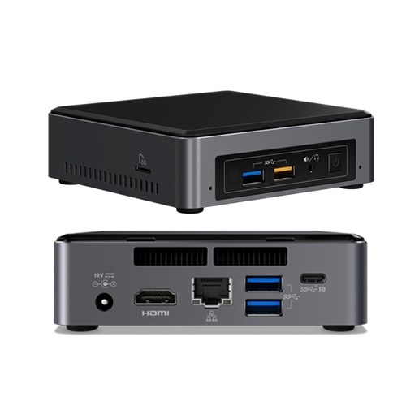

1.  Intel NUCs
2.  [Hetzner Server Auctions](https://www.hetzner.com/sb) (20-50USD/mo).
3.  NAS/Network device.
4.  Gamer? [`r/pcmasterrace/wiki`](https://www.reddit.com/r/pcmasterrace/wiki/builds)

<!-- _TODO: better image_ -->

---

# <!-- _class: white  bottom-->have some old laptops?

<!-- https://preview.redd.it/b9fvg5yo5dl21.jpg?width=1024&auto=webp&s=9a5a4d9fdd4e486a23c159f4e4e27e88942018f5 -->

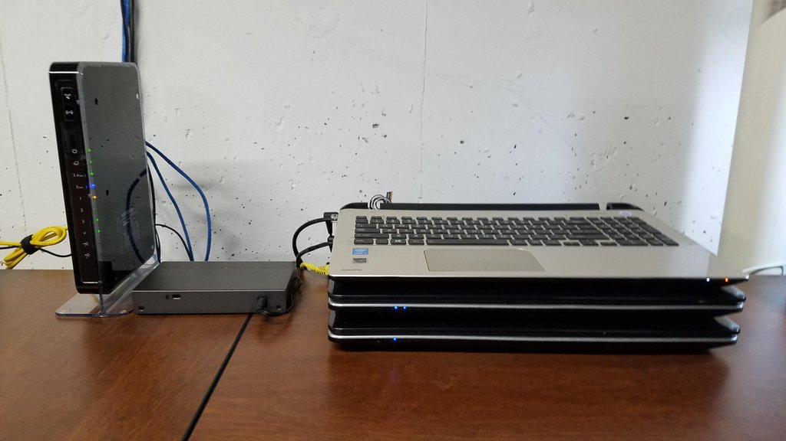

---

# <!-- _class: white  bottom-->really into networking?

<!-- https://preview.redd.it/8682wq9m8kn21.jpg?width=576&auto=webp&s=41e7ab264fcbb054209981126259b9b44b9d1d70 -->

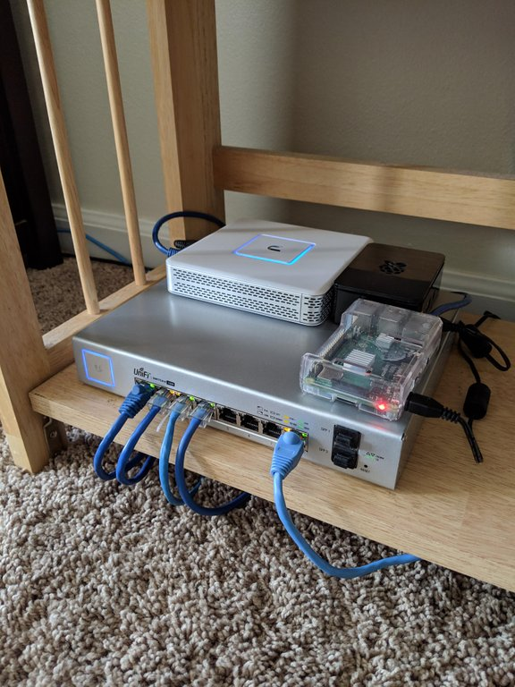

---

# <!-- _class: white bottom -->really want a cluster?

<!-- http://raspberrywebserver.com/raspberrypicluster/raspberry-pi-cluster.html -->

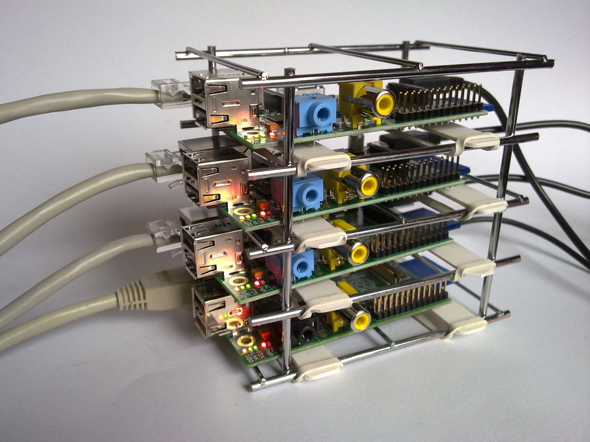

---

# Hybrid

- Local Disk, Cloud Compute

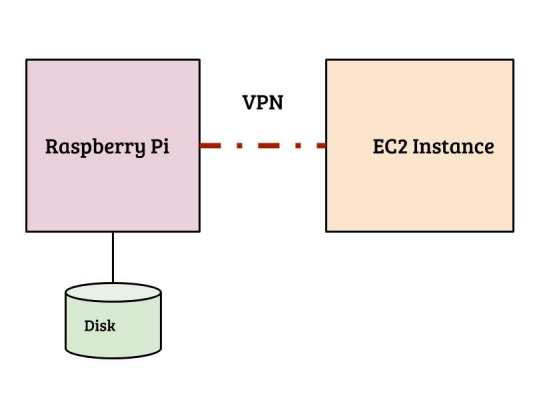

---

|                     | Cloud              | Pi  | PC\*     | Hybrid | NAS |
| :------------------ | ------------------ | --- | -------- | ------ | --- |
| **Security** :lock: | +                  | ++  | ++       | +      | ++  |
| **Utility**         | +++                | -   | :dollar: | ++     | -   |
| **Cost**            | :money_with_wings: | +++ | ++       | +      | ++  |
| **Setup-Ease**      | +                  | +   | -        | --     | ++  |
| **Ops-Ease**        | ++                 | -   | +        | -      | ++  |
| **Storage**         | --                 | -   | +        | ++     | ++  |
| **Gaming**          | --                 | -   | ++       | ++     | --  |
| **HTPC**            | :dollar:           | +   | ++       | ++     | +   |

<!-- - \*Includes DIY/PC/Alienware/Old Laptops/Gaming PC -->

---

# <!--fit--><!-- _class: lead white -->glue


---

# software

1.  docker **\***
2.  kubernetes
3.  ansible/puppet/chef
4.  helm?
5.  [tool-of-your-choice](https://docs.google.com/spreadsheets/d/1FCgqz1Ci7_VCz_wdh8vBitZ3giBtac_H8SBw4uxnrsE/edit#gid=0)
6.  [Unraid](https://www.unraid.net/)
7.  [HomelabOS](https://gitlab.com/NickBusey/HomelabOS)

---

# <!--fit--><!-- _class: lead white -->pick something dumb


---

# containers?

- secure
- declarative configuration
- orchestration is 100x easier

---

# networking

- Public + Static IP Address
- Floating/Elastic IP
- VPN
- Wildcard DNS/TLS

---

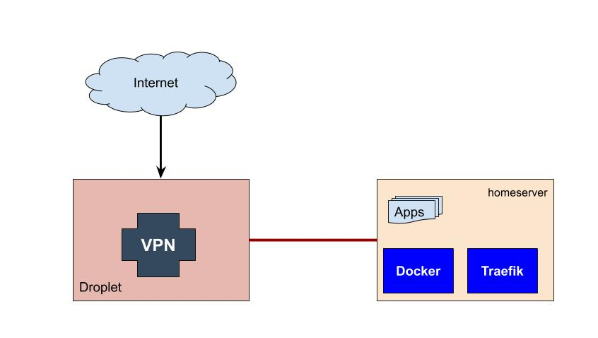

---

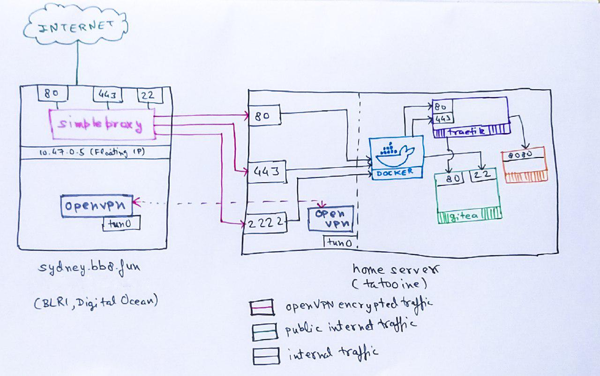

---

<!--

REM What follows are some slides on
REM on how I configure my network and infrastructure
REM with docker/terraform, but they aren't
REM useful for the audience, so skipped

# configuration

- terraform + docker
- kubernetes + helm
- ansible + galaxy
- docker-compose

---

# terraform

```json
module "requestbin" {
  name   = "requestbin"
  source = "./modules/container"
  image  = "jankysolutions/requestbin:latest"
  web {
    expose = true
    port   = "8000"
    host   = "requestbin.bb8.fun"
  }
  networks = "${list(module.docker.traefik-network-id)}"
}
```

- source: <https://git.captnemo.in/nemo/nebula>
- [terraform.io/docker](https://www.terraform.io/docs/providers/docker/)

---

# Docker API

1.  Manage networks,
2.  Containers,
3.  Configuration

All over a API, but only for one host.

docker swarm, but single host

--- -->

# <!--fit--><!-- _class: lead white -->security


---

# security

0.  Run everything in isolation
1.  Don't expose services
1.  Expose services without auth over VPN only
1.  Don't expose management services over Internet
1.  Keep services behind Auth (even Basic Auth works)
1.  Go Hybrid

---

# <!--fit--><!-- _class: lead white -->buy a raspberry pi today


---

# self-hosting references

- [kickball/awesome-selfhosted](https://github.com/Kickball/awesome-selfhosted)
- [linuxserver.io](https://www.linuxserver.io/)
- [r/selfhosted](https://reddit.com/r/selfhosted)

<!-- paginate: true -->

<style>
section.lead h1 {
  text-align: center;
}
section.white h1 {
  color: white !important;
}

h1,h2,h3,h4,h5 {
  font-weight: bold;
  font-family: 'Yanone Kaffeesatz', sans-serif !important;
  color: #2c3e50;
}
h1 {
  font-size: 3em;
}

h2 {
  font-size: 2em;
}h3 {
  font-size: 1.3em;
}

section.bottom>*, section.bottom {
  text-align: center;
  padding-top: 300px;
  text-shadow: -1px -1px 0 #34495e, 1px -1px 0 #34495e, -1px 1px 0 #34495e, 1px 1px 0 #34495e;
}
</style>

---

# questions?

- [me@captnemo.in](mailto:me@captnemo.in)
- [@captn3m0](https://twitter.com/captn3m0)
- [captnemo.in/archive.html](https://captnemo.in/archive.html)
- [captnemo.in/talks/](https://captnemo.in/talks/hs/)

<!---
0. SPEAK SLOWLY
1. check colors and fix colors.
2. skip clustering
3. Fix colors
4. Cloud Icon Fix
5. Software section mention backups again
-->

[nc]: https://nextcloud.com/
[miniflux]: https://github.com/miniflux/miniflux/
[timemachine]: https://github.com/odarriba/docker-timemachine/
[wiki]: https://docs.requarks.io/wiki/install/docker
[radicale]: https://radicale.org/
[rssb]: https://github.com/RSS-Bridge/rss-bridge
[gitea]: https://gitea.io/
