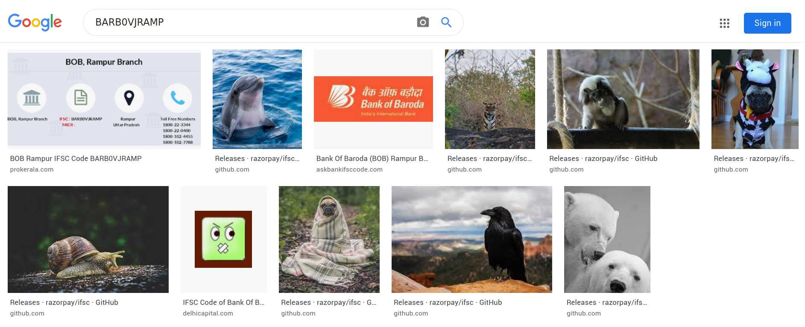
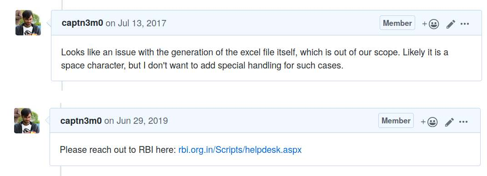
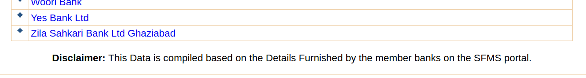
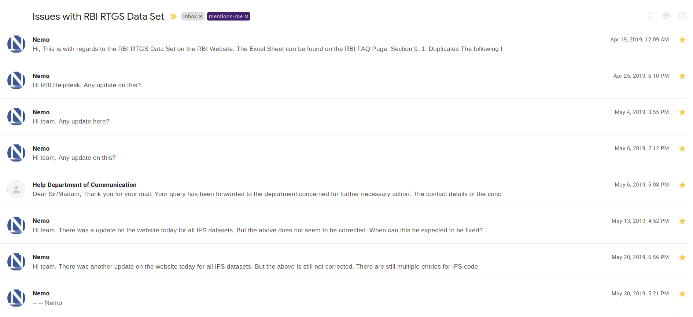
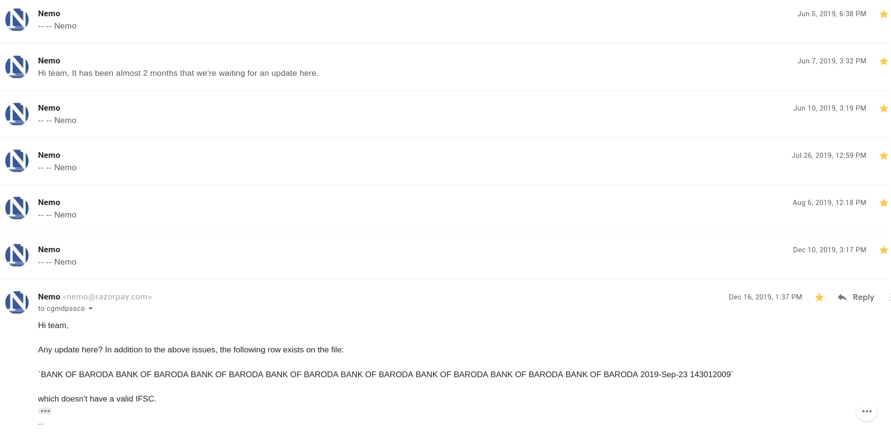

# IFSC

\-nemo
\- Payments & Fintech deepdives

---

# Q: What does IFSC stand for?

---

# 

---

## **International Financial Services Centre**

(Only partly kidding: <https://www.rbi.org.in/Scripts/NotificationUser.aspx?Id=9619&Mode=0>)

> In exercise of the powers conferred by section 47 of the Foreign Exchange Management Act, 1999 (42 of 1999), the Reserve Bank makes the following regulations relating to financial institutions set up in International Financial Services Centres, namely:-
>
> > (f) ‘International Financial Services Centre’ or ‘IFSC’ shall have the same meaning given in Section 2 (q) of the Special Economic Zones Act, 2005 (28 of 2005).

---

## Fine!

**Indian Financial System Code**

---

## Agenda

1. The [ifsc.razorpay.com](https://ifsc.razorpay.com) project.
2. IFSC in the background.
3. Future Scope / Collaboration ideas.

---

## some metrics first

- 4 Years since first release (Feb 2016)
- 64 releases
- 72 tags

```
-------------------------------------------------------------------------------
Language                     files          blank        comment           code
-------------------------------------------------------------------------------
PHP                             13            175             68           2063
Ruby                             9            111             23           2008
JavaScript                       5             26              1           1548
YAML                             5              4             24           1256
Markdown                         4            157              0            383
Elixir                           8             53             63            308
Bourne Shell                     2             10             13             31
-------------------------------------------------------------------------------
SUM:                            47            536            192           7613
-------------------------------------------------------------------------------
```

---

## 0.1.7


---



---

# the IFSC wall of cuteness

---


---

# what is it?

The IFSC Toolkit includes:

1. An API, served publicly at https://ifsc.razorpay.com
2. A dataset, attached to every release in multiple formats
3. An SDK that does multiple things:
   - Offline IFSC validations
   - Requests to the API
   - Offline Bank checks
4. In various languages: Node.JS/PHP/Ruby/Elixir

---

# what's the source?

## 3 Primary Sources: RBI/NPCI/RTI

RBI publishes a list of all RTGS/NEFT branches as excel sheets:

- NEFT: [rbidocs.rbi.org.in/rdocs/content/docs/68774.xlsx](https://rbidocs.rbi.org.in/rdocs/content/docs/68774.xlsx)
- RTGS: [rbidocs.rbi.org.in/rdocs/RTGS/DOCs/RTGEB0815.xlsx](https://rbidocs.rbi.org.in/rdocs/RTGS/DOCs/RTGEB0815.xlsx)

NPCI publishes a few lists:

- All Live ACH member banks: [npci.org.in/national-automated-clearing-live-members-1](https://www.npci.org.in/national-automated-clearing-live-members-1)
- All UPI live member banks: [npci.org.in/upi-live-members](https://www.npci.org.in/upi-live-members)
- [NBIN codes](https://docplayer.net/25942453-Imps-procedural-guidelines.html), published in IMPS Procedural guidelines v1.7

---

## Additional Sources

- Any interim RBI circulars
- Any guidelines from NPCI
- A few RBI/NCPI circulars

---


---

## `banks.json`

List of all Banks in India\* with the following details:

- Bank Code (4 characters)
- Bank Type
- Primary IFSC (Usually of the IMPS HO Branch)
- Primary MICR (Used on Cheques)
- IIN (First 6 digits of issued cards)
- ABPS Support (true/false)
- NACH/ACH Credit/Debit Support (true/false)
- UPI Support (true)

\* - Based on all members listed in the NPCI ACH list.

---

## `banks.json`

```json
{
  "SBIN": {
    // Bank Code
    "code": "SBIN",
    // Bank Type
    "type": "PSB",
    // Primary IMPS IFSC
    "ifsc": "SBIN0004343",
    "micr": "400002000",
    // IIN = BIN
    "iin": "508548",
    // Aadhaar Payments Bridge System
    "apbs": true,
    "ach_credit": true,
    "ach_debit": true,
    "nach_debit": true,
    "upi": true
  }
}
```

---

# `by-bank.tar.gz` (8.4MB)

A tar.gz file containing one JSON file for each bank, with a list of all known branches with the following details for every branch:

- IFSC
- Branch name
- Address (Centre/District/State/Address/Contact)
- Bank Name
- UPI/RTGS/NEFT/IMPS Support (`true/false`)
- MICR

---

# `by-bank/PYTM.json`

Same as the data at <https://ifsc.razorpay.com/PYTM0000001>

```json
{
  "PYTM0000001": {
    "BANK": "PAYTM PAYMENTS BANK LTD",
    "IFSC": "PYTM0000001",
    "BRANCH": "RTGS-HO",
    "CENTRE": "NOIDA",
    "DISTRICT": "NOIDA",
    "STATE": "UTTAR PRADESH",
    "ADDRESS": "B-121,Sector-5,Noida-201301",
    "CONTACT": "33996699",
    "IMPS": true,
    "RTGS": true,
    "CITY": "Gautam Buddh Nagar",
    "NEFT": true,
    "MICR": null
  }
}
```

---

# `IFSC-list.json` (4MB)

A single JSON file with every known IFSC code inside it.

---

# `IFSC.csv` (25MB)

Single CSV file containing the same fields as the by-bank JSON file. Covers all banks.

---

# `IFSC.json` (1.7MB)

A somewhat-compressed, human-readable JSON file containing all valid IFSCs for a bank, with leading zeroes removed.

```
"ADCC": [1,2,3,4,5,6,7,8,9,10,11,12,13,14,15,16,17,18,19,20
21,22,23,24,25,26,28,29,30,31,32,33,34,35,36,37,38
39,40,41,42,43,44,45,46,47,48,49,50,51,52,53,54,55
56,57,58,59,60,61,62,64,65,66,67,68,110,114,70,71
72,73,74,75,76,77,78,79,80,81,82,83,84,85,86,87
88,89,90,91,92,93,94,95,96,97,98,99,100,101,102
103,104,105,106,107,108,109,111,112,113,115,116]
```

`ADCC0000001` to `ADCC0000116` are all valid branches.

---

# `banknames.json`

A manually curated human-readable list of all banknames against 4 letter bank codes. Currently at 1437 entries.

```json
  "CCOB": "City Co-operative Bank",
  "CCUX": "Chengelpattu Co-operative Urban Bank",
  "CDCX": "Cuddalore District Central Co-operative Bank",
  "CEBX": "Central Co-operative Bank Bikaner",
  "CGBX": "Chhattisgarh Gramin Bank",
  "CGGX": "Chaitanya Godavari Grameena Bank",
  "CHAS": "JP Morgan Chase Bank",
  "CHAX": "Chamoli Zila Sahkari Bank",
  "CHBX": "Chamba Urban Co-operative Bank",
```

---

# The API

Has a single `/:ifsc` endpoint that returns all the information about the branch from the IFSC code. <https://ifsc.razorpay.com/PUNB0026200>

```json
{
  "BRANCH": "KASHIPUR",
  "CENTRE": "KASHIPUR",
  "DISTRICT": "KASHIPUR (UTTARANCHAL)",
  "STATE": "UTTARAKHAND",
  "ADDRESS": "MATA MANDIR ROAD,DISTT. UDHAM SINGH NAGAR",
  "CONTACT": "",
  "UPI": true,
  "RTGS": true,
  "CITY": "KASHIPUR (UTTARANCHAL)",
  "NEFT": true,
  "IMPS": true,
  "MICR": "",
  "BANK": "Punjab National Bank",
  "BANKCODE": "PUNB",
  "IFSC": "PUNB0026200"
}
```

---

## Code Examples

### PHP

```php
IFSC::validate('KKBK0000261'); // true
IFSC::validateBankCode('PUNB'); // true

IFSC::getBankName('PUNB'); // Returns 'Punjab National Bank'
IFSC::getBankName('ABCD'); // Returns null

IFSC::getBankName(Bank::PUNB); //Returns Punjab National Bank
```

---

```php
Bank::getDetails(Bank::PUNB);
Bank::getDetails('PUNB');

// Returns an array:
// [
//    'code' => 'PUNB',
//    'type' => 'PSB',
//    'ifsc' => 'PUNB0244200',
//    'micr' => '110024001',
//    'iin' => '508568',
//    'apbs' => true,
//    'ach_credit' => true,
//    'ach_debit' => true,
//    'nach_debit' => true,
//    'name' => 'Punjab National Bank',
//    'bank_code' => '024',
//    'upi' => true
// ]
```

---

## lookups

```php
$client = new Client();
$res = $client->lookupIFSC('KKBK0000261');

echo $res->bank; // 'KOTAK MAHINDRA BANK LIMITED'
echo $res->branch; // 'GURGAON'
echo $res->address; // 'JMD REGENT SQUARE,MEHRAULI GURGAON ROAD,OPPOSITE BRISTOL HOTEL,'
echo $res->contact; // '4131000'
echo $res->city; // 'GURGAON'
echo $res->district; // 'GURGAON'
echo $res->state; // 'HARYANA'
echo $res->getBankCode(); // KKBK
echo $res->getBankName(); // 'Kotak Mahindra Bank'
```

---

# Node.js

```js
ifsc.validate('BOTM0XEEMRA'); // returns false

// Look ma, promises!
ifsc.fetchDetails('KKBK0000261').then(function(res) {
  console.log(res);
});

console.log(ifsc.bank.PUNB); // Prints 'PUNB'
```

---

# Ruby

```ruby
Razorpay::IFSC::IFSC.validate! 'KKBK0000261' # => true

# Fetches details over API, constants as well
Razorpay::IFSC::Bank.get_details Razorpay::IFSC::Bank::PUNB
{
   code: 'PUNB',
   type: 'PSB',
   ifsc: 'PUNB0244200',
   micr: '110024001',
   bank_code: '024',
   iin: '508568',
   apbs: true,
   ach_credit: true,
   ach_debit: true,
   nach_debit: true
}
```

---

# Support Matrix

| Language | Validation | API Client | Sublet Support (Custom) | Bank Constants |
| -------- | ---------- | ---------- | ----------------------- | -------------- |
| PHP      | ✅         | ✅         | ✅ (✅)                 | ✅             |
| Ruby     | ✅         | ✅         | ✅ (✅)                 | ✅             |
| Elixir   | ✅         | ✅         | ✅ (❎)                 | ❎             |
| Node.js  | ✅         | ✅         | ❎ (❎)                 | ✅             |

---

# Growth Chart


---


---

# planned learnings

- polyglot-single-repo-packages
- open-data-superfast-public-APIs
- scapegoat-application for random tests

---

# polyglot

```
src/banknames.json
src/ruby
src/banks.json
src/patches
src/custom-sublets.json
src/elixir
src/node
src/IFSC.json
src/sublet.json
src/php
```

---


---

# 1. There are too many banks in India

- `banknames.json` holds 1400+ named banks
- Adding sublets, it adds up to atleast 2500+
- Not all banks are recognized by RBI (with a 4 letter code)

---

# 2. There are 11 kinds of banks in India:

- DCCB (District Co-operative Central Bank)
- Foreign Bank
- LAB (Local Area Bank)
- O-UCB (Urban Co-operative Bank)
- PB (Payment Bank)
- Private (Private Sector Banks)
- PSB (Public Sector Bank)
- RRB (Regional Rural Bank)
- S-UCB (State Urban Co-operative Banks)
- SCB (State Co-operative Bank)
- SFB (Small Finance Bank)

---

# 3. RBI has no idea what its doing.

```
"IPOS": "India Post Payments Bank",
"IPPB": "India Post Payments Bank",
```

## `IPOS0000001`

---

# 3.1 AJAR/AJUX

```
"AJAR": "Ajara Urban Co-operative Bank",
"AJUX": "Ajara Urban Co-operative Bank",
```

---

## 3.2 CXBX (Chartered Sahakari Bank Niyamitha)

`CSBX0CSB001` (Supports only IMPS, not listed by RBI)

---

## 3.3 KOEX (KEB Hana Bank)

```
KOEX0000001: RTGS/NEFT/IMPS
KOEX0000002: RTGS/NEFT/IMPS
KOEX00000SC: RTGS/IMPS
```

---

# 4. The NPCI doesn't come under RTI

> The contention arises from the fact that while it is incorporated as a non-profit organisation, 57 percent of its shares are held by public sector banks.

> “In a reply to an RTI, we found that AP Hota, the chief general manager of the RBI, was deputed by the Bank for two years to the management. Moreover, the RTI also revealed that RBI had provided office space as well as an inventory list of items to NPCI.”

## Judgement:

> Commission is also of the view that it may be open to the complainantto seek information through public authority for NPCI i.e. RBI or Ministry of Financeas the case may be. That being so, the complaint of the complainant is unfounded and the same is rejected. <https://bit.ly/39dsFK6> (Dec 2019)

---

# 5. Companies still use MICR

(Magnetic Ink Character Recognition code)

```
000     000    000
City    Bank  Branch
```

---

# 6. IBAN

## International Bank Account Number

> the Committee felt that longest IBAN is most suitable for the country. Longest IBAN envisages 26 digits IBAN for the banks in India with 18 digit account number, 4 digit bank code, 2 digit country code and 2 check digits. Under this system, banks can continue to use the existing account numbers, and where necessary the number will be padded with zeros to make the length of 18 digits as required.

`IN` + Check Digit + Bank Code + Account Number

- Bank Code: `[:alpha:]{4}`
- Check Digit: `[:digit:]{2}`
- Account Number: `[:alphanum:]{18}`

Source: <https://www.iban.in/structure.html>

---

# 7. Bank Mergers are fun!

> After merger, for all outward IMPS transactions of associate banks the IFS Code will changeand will be intimated to customer. However for all the inward IMPS transaction bank will support old IFSC number till 1 Month from the date of merger.
>
> - [SBI](https://bank.sbi/webfiles/uploads/files/mergerofassociatebanks/IMPS%20Merger%20FAQ.pdf)

But every merger is handled differently.

---

# 8. Naming banks is hard

- 20 different ways to write "Co-operative"
- Zhilla, Zila, Jila, Jhila, District
- Sahkari, Sahakari, Sah.,

This was so problematic, that I ended up writing [Guidelines on how to keep bank names consistent](https://github.com/razorpay/ifsc/blob/master/CONTRIBUTING.md#bank-names-guidelines).

---

# 8.5 Guiding Principles

1. Keep "dataset" current (no dead IFSCs).
2. Keep list of banks comprehensive (include dead banks).
3. Only use official upstream sources.

---

# 9. IFSC Issuance Process

- RBI issues 4 letter Bank Codes.
- They end in "X" for banks not connected to RBI payment/settlement systems
- Banks inform RBI of IFSCs for each branch via [SFMS](http://www.idrbt.ac.in/sfms.html)
- Banks inform NPCI separately of IFSCs for each branch via NFS (?)
- Issuance of each branch code is entirely owned by the bank.

---

# 10. So many codes

- IFSC code for IMPS
- IFSC code for NEFT/RTGS
- MICR code for cheques
- SWIFT/SWIFT-BIC/BIC code for International inbound transfers
- IBAN (International Bank Account Number)
- NBIN (National Bank Identification) `[:digit:]{4}``
- MMID `[:digit:]{7}` (NBIN+MAS (Mobile Account Selector, `[:digit:]{3}`))

---

# 11. I have no idea what I'm doing

- NBIN format
- Compression/Bloom Filter attempts

---

# 12. NPCI has no idea what it's doing

`@jio,@ezeepay,@lime,@purz,@s2b,@srcb,@upi`

UPI handles with unknown issuing bank.

What happens to MDR?

---

# 13. RBI doesn't care about data sanity

## 13.1 Encoding Issues

`"CHENNAI - CENOTAPH ROAD "`
`"1, CENOTAPH ROAD, CHENNAI. "`

---

## 13.2 RBI Excel Sheets are broken

```
[WARN] IFSC code longer than 11 characters: IOBA0003378                                                  RO-TIRUPATHI, using IOBA0003378
[WARN] IFSC code longer than 11 characters: BANK OF BARODA, using BANKOFBAROD
[WARN] Second Entry found for HDFC0000917, discarding
[WARN] Second Entry found for FDRL0001808, discarding
[WARN] Second Entry found for ICIC0000248, discarding
[WARN] Second Entry found for ICIC0000557, discarding
[WARN] Second Entry found for ICIC0006252, discarding
[WARN] Second Entry found for CNRB0006822, discarding
[WARN] Second Entry found for DBSS0IN0901, discarding
```

---

# 13.3 RBI Excel Sheets are very broken

```
[WARN] Second Entry found for ICIC0002261, discarding
[WARN] Second Entry found for IDFB0040138, discarding
[WARN] Second Entry found for CBIN0284329, discarding
[WARN] Second Entry found for UTIB0002805, discarding
[WARN] Second Entry found for DCBL0000126, discarding
[WARN] Second Entry found for ICIC0000276, discarding
[WARN] Second Entry found for ICIC0006033, discarding
[WARN] IFSC code longer than 11 characters: IOBA0003379                                            RO-NAGERCOIL, using IOBA0003379
[WARN] IFSC code longer than 11 characters: IOBA0003392
[INFO] Removed BANKOFBAROD from the list
```

---



---



---



---



---

# 14. [NEFT blocks](https://github.com/razorpay/ifsc/issues/154)

> the below following banks have been temporarily kept out of NEFT system (only) due to technical non-compliance, as such these bank will not be in a position to receive or make payments through NEFT till further orders.

> The NEFT payments will be REJECTED by RBI with reason as “SENDER OR BENEFICIARY BANK NOT PARTICIPANT OF NEFT”, if we received and sent for settlement.

---

# NEFT Blocks

| Bank Name                    | IFSC Main Code | Total Branches |
| ---------------------------- | -------------- | -------------- |
| BANK OF CEYLON               | BCEY           | 3              |
| KAVERI GRAMEENA BANK         | KGRB           | 488            |
| KERALA GRAMIN BANK           | KLGB           | 650            |
| KRUNG THAI BANK PCL          | KRTH           | 2              |
| PRAGATHI KRISHNA GRAMIN BANK | PKGB           | 1160           |
| SBM BANK MAURITIUS LTD       | STCB           | 2              |

---

# 

---

# 15. Sublet Branches

```json
{
  "RTGS": true,
  "CONTACT": "9890960146",
  "CITY": "SOLAPUR",
  "IMPS": true,
  "ADDRESS": "6151 1 SIDDHESHWAR SHOPING CENTER SHOP NO 18 19 SIDHESHWAR PETH SOLAPUR",
  "DISTRICT": "SOLAPUR",
  "CENTRE": "SOLAPUR",
  "STATE": "MAHARASHTRA",
  "NEFT": true,
  "BRANCH": "Solapur Social Urban Co-operative Bank IMPS",
  "MICR": "413590002",
  "UPI": true,
  "BANK": "Solapur Social Urban Co-operative Bank",
  "BANKCODE": "SSLX",
  "IFSC": "HDFC0CSSUCB"
}
```

---

# Sublet Identification

1. [NPCI ACH List](https://www.npci.org.in/national-automated-clearing-live-members-1) documents the IFSC that each bank provides for their IMPS setup
2. The Excel sheets provided by RBI have a bank name in the "branch name" field.

Becomes much harder because bank names submitted to RBI may be different from what's submitted to NPCI, and doing exact matches for bank names is impossible.

---

# 

---

# tech

1. scraper, written in ruby/bash (~400 lines)
2. release notes generator script, written in PHP
3. A patch manager to "fix" issues

---

# run it yourselves:

```sh
git clone https://github.com/razorpay/ifsc.git
cd ifsc/scraper
bundle install
cd scripts
./bootstrap.sh
```

Check the `ifsc/scraper/scripts/data` directory once it finishes.

---

```yaml
---
# https://github.com/razorpay/ifsc/issues/154
action: patch
patch:
  NEFT: false
ifsc:
  # - KRTH0INBB00
  - BCEY0000001
  - BCEY0CHEN01
  - KGRB0000001
  - KGRB0000002
  - KGRB0000004
```

---

```yaml
---
# https://github.com/razorpay/ifsc/issues/126
# Source: https://www.npci.org.in/upi-live-members
# Last Updated: Jan 2020 (Count = 143)
action: patch
patch:
  :upi: true
banks:
  - ABHY
  - ACBX
  - ADBX
  - AGVX
  - AIRP
  - ALLA
```

---

# Rigorous Tests

## Ensure Coverage between datasets

```
testNames
testConstants
testCoverageAgainstBankNames
testConstantsAgainstNames
testSubletsAgainstConstants
testConstantsAgainstCompleteBanksList
testSubletCoverage
testValidateJsonFormat
testNpciListAgainstRbi
testPatches
```

---

## Ensure common tests between languages

```json
  "testBasicValidator": {
    "KKBK0000261": true,
    "HDFC0002854": true,
  },
  "testValidateStringLookup": {
    "BOTM0NEEMRA": true,
    "BARB0ZOOTIN": true
  },
  "testValidateInvalidCode": {
    "BOTM0XEEMRA": false,
  },
  "testHPSC": {
    "HPSC0000406": true,
    "HPSC0000300": false
  },
  "testEdgeCases": {
    "SBMY0040704": false
  },
  "testSBIOldCodes": {
    "SBBJ0010004": false,
    "SBBJ0010006": false,
```

---

## Ensure coverage across languages

```ruby
it 'should match all constants defined in PHP' do
    constants_file = File.readlines('src/php/Bank.php')
  bank_constants = constants_file
    .select { |e| e.match(/const/) }
    .map { |e| e[/\s+const (\w{4})/, 1] }
  bank_constants.each do |c|
    expect(described_class::const_get(c)).to eq c.to_sym
  end
end
```

---

## Ensure coverage across languages

```js
// Validates that all constants defined in PHP are also defined in Node
let file = fs
  .readFileSync('src/php/Bank.php')
  .toString()
  .split('\n')
  .filter((l) => {
    return l.indexOf('const') > -1;
  })
  .map((l) => {
    return l.match(/\s+const (\w{4})/)[1];
  })
  .forEach((code) => {
    assert.equal(BANK[code], code);
    assert.equal(IFSC.bank[code], code);
  });
```

---

## The API (<https://github.com/razorpay/ifsc-api/>)

1. Has all the data committed (huge repo, split-off)
2. Multi-stage docker build (150MB)
3. Uses Ruby/Sinatra/Redis for serving requests

---

# Future Scope

1. [SWIFT code](https://github.com/razorpay/ifsc/issues/125) for every bank branch. ([In Progress](https://github.com/razorpay/ifsc/pull/176))
2. [AePS Membership Status](https://github.com/razorpay/ifsc/issues/186)
3. Document _all sublet branches, even the undeclared ones_. ([WIP](https://github.com/razorpay/ifsc/pull/166))
4. Document _all banks, even the undeclared/dead ones_ ([WIP](https://github.com/razorpay/ifsc/pull/166))
5. Support for more languages. Contributions welcome.
6. Improve API to support usecases with free-text search.
7. Add support for hotlinking bank logos (`https://ifsc.razorpay.com/PUNB.svg`)

---

# Special Sublet Work

```yaml
HDFC0CSLABK: Subhadra Local Area Bank
HDFC0CSLCBL: Shree Laxmi Co-operative Bank
HDFC0CSLKUB: Shri Laxmikrupa Urban Co-operative Bank
HDFC0CSMCBL: Satana Merchants Co-operative Bank
HDFC0CSMLCB: Shree Mahayogi Lakshmamma Co-operative Bank
HDFC0CSMNSB: Sanmitra Mahila Nag Sahakari Bank
HDFC0CSMPAY: Sangamner Merch Co-operative Bank
HDFC0CSMPBA: Shankarrao Mohite Patil Sah.bank
HDFC0CSMRTB: Smriti Nagrik Sahakari Bank
HDFC0CSMSSB: Shri Mahila Sewa Sahakari Bank
HDFC0CSMUCB: Shri Mahavir Urb Co-operative Bank
HDFC0CSNCBL: Saraspur Nagarik Co. Op. Bank
HDFC0CSNCBR: Surat National Co-operative Bank
HDFC0CSNSB0: Sankheda Nagrik Sahakari Bank
HDFC0CSNSBB: Sarakari Naukarara Sahakari Bank
HDFC0CSNSBH: Sihor Nagarik Sahakari Bank
HDFC0CSNSBL: Sonbhadra Nagar Sahakari Bank
HDFC0CSNSBM: Sadguru Nagrik Sahakari Bank
HDFC0CSNSBS: Sehore Nagrik Sahakari Bank
```

---

# RBI

List of all [Non-scheduled Urban Co-operative Banks](https://rbidocs.rbi.org.in/rdocs/Content/pdfs/nonschedulecoop.pdf)(PDF):

```yaml
Name: Shankerrao Mohite-Patil Sahakari Bank Ltd
RO Name: NAGPUR
HO Address: "Sahakar Mandir", Mahaveer Path, Akluj, Solapur, Maharashtra
Pincode: 413101
```

<!-- Limbo Bank, registered with RBI, but without a code -->

---

## [captnemo.in/talks/ifsc/](https://captnemo.in/talks/ifsc/)

Source : https://github.com/captn3m0/talks/tree/gh-pages/ifsc
