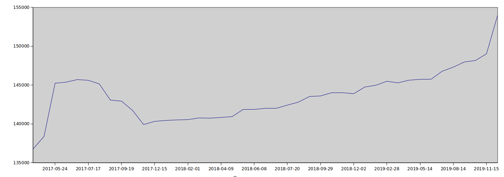

# Things nobody ever tells you about IFSC

\- nemo

---

# Q: What does IFSC stand for?

---

# WRONG!

---

## **International Financial Services Centre**

(Only partly kidding: <https://www.rbi.org.in/Scripts/NotificationUser.aspx?Id=9619&Mode=0>)

> In exercise of the powers conferred by section 47 of the Foreign Exchange Management Act, 1999 (42 of 1999), the Reserve Bank makes the following regulations relating to financial institutions set up in International Financial Services Centres, namely:-
>
> > (f) ‘International Financial Services Centre’ or ‘IFSC’ shall have the same meaning given in Section 2 (q) of the Special Economic Zones Act, 2005 (28 of 2005).

---

## Fine!

**Indian Financial System Code**

---

## some metrics first

- 4 Years since first release
- 64 releases
- 72 tags

```
-------------------------------------------------------------------------------
Language                     files          blank        comment           code
-------------------------------------------------------------------------------
PHP                             13            175             68           2063
Ruby                             9            111             23           2008
JavaScript                       5             26              1           1548
YAML                             5              4             24           1256
Markdown                         4            157              0            383
Elixir                           8             53             63            308
Bourne Shell                     2             10             13             31
XML                              1              0              0             16
-------------------------------------------------------------------------------
SUM:                            47            536            192           7613
-------------------------------------------------------------------------------
```

---

## 0.1.7


---


---

# the IFSC wall of cuteness

---


---

# what is it?

The IFSC Toolkit includes:

1. An API, served publicly at https://ifsc.razorpay.com
2. A dataset, attached to every release in multiple formats
3. An SDK that does multiple things:
   - Offline IFSC validations
   - Requests to the API
   - Offline Bank checks
4. In various languages: Node.JS/PHP/Ruby/Elixir

---

# what's the source?

## 3 Primary Sources: RBI/NPCI/RTI

RBI publishes a list of all RTGS/NEFT branches as excel sheets:

- [NEFT](https://rbidocs.rbi.org.in/rdocs/content/docs/68774.xlsx)
- [RTGS](https://rbidocs.rbi.org.in/rdocs/RTGS/DOCs/RTGEB0815.xlsx)

NPCI publishes a few lists:

- [All Live ACH member banks](https://www.npci.org.in/national-automated-clearing-live-members-1)
- [All UPI live member banks](https://www.npci.org.in/upi-live-members)
- [NBIN codes](https://docplayer.net/25942453-Imps-procedural-guidelines.html), published in IMPS Procedural guidelines v1.7

---

# what's the data?

## `banks.json`

List of all Banks in India\* with the following details:

- Bank Code (4 characters)
- Bank Type
- Primary IFSC (Usually of the IMPS HO Branch)
- Primary MICR (Used on Cheques)
- IIN (First 6 digits of issued cards)
- ABPS Support (true/false)
- NACH/ACH Credit/Debit Support (true/false)
- UPI Support (true)

\* - Based on all members listed in the NPCI ACH list.

---

# `by-bank.tar.gz` (8.4MB)

A tar.gz file containing one JSON file for each bank, with a list of all known branches with the following details for every branch:

- IFSC
- Branch name
- Address (Centre/District/State/Address/Contact)
- Bank Name
- UPI Support (`true/false`)
- RTGS Support (`true/false`)
- NEFT Support (`true/false`)
- IMPS Support (`true/false`)
- MICR

---

# `IFSC-list.json` (4MB)

A single JSON file with every known IFSC code inside it.

---

# `IFSC.csv` (25MB)

Single CSV file containing the same fields as the by-bank JSON file. Covers all banks.

---

# `IFSC.json` (1.7MB)

A somewhat-compressed, human-readable JSON file containing all valid IFSCs for a bank, with leading zeroes removed.

```
"ADCC": [1,2,3,4,5,6,7,8,9,10,11,12,13,14,15,16,17,18,19,20
21,22,23,24,25,26,28,29,30,31,32,33,34,35,36,37,38
39,40,41,42,43,44,45,46,47,48,49,50,51,52,53,54,55
56,57,58,59,60,61,62,64,65,66,67,68,110,114,70,71
72,73,74,75,76,77,78,79,80,81,82,83,84,85,86,87
88,89,90,91,92,93,94,95,96,97,98,99,100,101,102
103,104,105,106,107,108,109,111,112,113,115,116]
```

`ADCC0000001` to `ADCC0000116` are all valid branches.

---

# `banknames.json`

A manually curated human-readable list of all banknames against 4 letter bank codes. Currently at 1425 entries.

---

# The API

Has a single `/:ifsc` endpoint that returns all the information about the branch from the IFSC code. <https://ifsc.razorpay.com/PUNB0026200>

```json
{
  "BRANCH": "KASHIPUR",
  "CENTRE": "KASHIPUR",
  "DISTRICT": "KASHIPUR (UTTARANCHAL)",
  "STATE": "UTTARAKHAND",
  "ADDRESS": "MATA MANDIR ROAD,DISTT. UDHAM SINGH NAGAR",
  "CONTACT": "",
  "UPI": true,
  "RTGS": true,
  "CITY": "KASHIPUR (UTTARANCHAL)",
  "NEFT": true,
  "IMPS": true,
  "MICR": "",
  "BANK": "Punjab National Bank",
  "BANKCODE": "PUNB",
  "IFSC": "PUNB0026200"
}
```

---

## Metrics

It supports prometheus metrics over `/metrics`.

---

## Code Examples

### PHP

```php
IFSC::validate('KKBK0000261'); // true
IFSC::validateBankCode('PUNB'); // true

IFSC::getBankName('PUNB'); // Returns 'Punjab National Bank'
IFSC::getBankName('ABCD'); // Returns null

IFSC::getBankName(Bank::PUNB); //Returns Punjab National Bank
```

---

```php
Bank::getDetails(Bank::PUNB);
Bank::getDetails('PUNB');

// Returns an array:
// [
//    'code' => 'PUNB',
//    'type' => 'PSB',
//    'ifsc' => 'PUNB0244200',
//    'micr' => '110024001',
//    'iin' => '508568',
//    'apbs' => true,
//    'ach_credit' => true,
//    'ach_debit' => true,
//    'nach_debit' => true,
//    'name' => 'Punjab National Bank',
//    'bank_code' => '024',
//    'upi' => true
// ]
```

---

## lookups

```php
$client = new Client();
$res = $client->lookupIFSC('KKBK0000261');

echo $res->bank; // 'KOTAK MAHINDRA BANK LIMITED'
echo $res->branch; // 'GURGAON'
echo $res->address; // 'JMD REGENT SQUARE,MEHRAULI GURGAON ROAD,OPPOSITE BRISTOL HOTEL,'
echo $res->contact; // '4131000'
echo $res->city; // 'GURGAON'
echo $res->district; // 'GURGAON'
echo $res->state; // 'HARYANA'
echo $res->getBankCode(); // KKBK
echo $res->getBankName(); // 'Kotak Mahindra Bank'
```

---

# Node.js

```js
ifsc.validate('BOTM0XEEMRA'); // returns false

// Look ma, promises!
ifsc.fetchDetails('KKBK0000261').then(function(res) {
  console.log(res);
});

console.log(ifsc.bank.PUNB); // Prints 'PUNB'
```

---

# Ruby

```ruby
Razorpay::IFSC::IFSC.validate! 'KKBK0000261' # => true

# Fetches details over API, constants as well
Razorpay::IFSC::Bank.get_details Razorpay::IFSC::Bank::PUNB
{
   code: 'PUNB',
   type: 'PSB',
   ifsc: 'PUNB0244200',
   micr: '110024001',
   bank_code: '024',
   iin: '508568',
   apbs: true,
   ach_credit: true,
   ach_debit: true,
   nach_debit: true
}
```

---

# Support Matrix

| Language | Validation | API Client | Sublet Support (Custom) | Bank Constants |
| -------- | ---------- | ---------- | ----------------------- | -------------- |
| PHP      | ✅         | ✅         | ✅ (✅)                 | ✅             |
| Ruby     | ✅         | ✅         | ✅ (✅)                 | ✅             |
| Elixir   | ✅         | ✅         | ✅ (❎)                 | ❎             |
| Node.js  | ✅         | ✅         | ❎ (❎)                 | ✅             |

---

# Growth Chart


