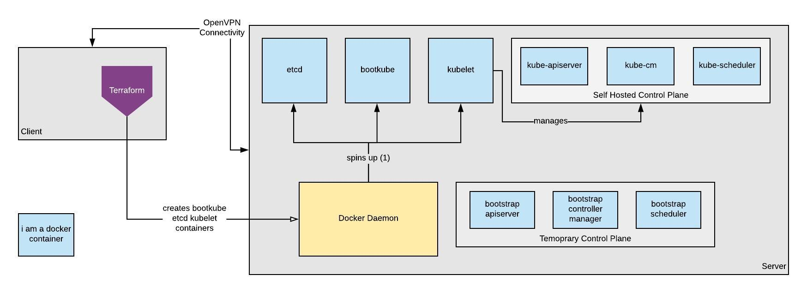

# running kubelet in a container

---

# kubelet?

---

# why?

---

---

-   [2015](https://github.com/kubernetes/kubernetes/issues/4869)
-   [mounts break](https://github.com/kubernetes/kubernetes/issues/6848)
-   RedHat/OpenShift uses `--containerized`
-   Deprecation [attempt 1](https://github.com/kubernetes/kubernetes/issues/43708), [attempt 2](https://github.com/kubernetes/kubernetes/issues/74148)

---

CoreOS used rkt for [kubelet-wrapper](https://github.com/coreos/coreos-overlay/blob/master/app-admin/kubelet-wrapper/files/kubelet-wrapper)

---

# challenges (docker flags)

-   privileged (`--privileged`)
-   pid (`--pid=host`)
-   network (`--network=host`)

---

# configuration?

-   `/etc/kubeconfig`
-   `/etc/kubeca.crt`
-   `/etc/ssl/certs`
-   `/usr/share/ca-certificates`
-   `/var/lib/kubelet`
-   `/opt/cni/bin`
-   `/etc/cni/net.d`
