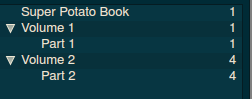
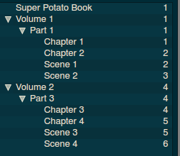
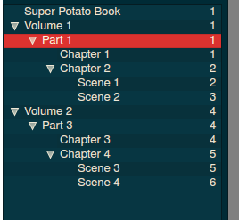
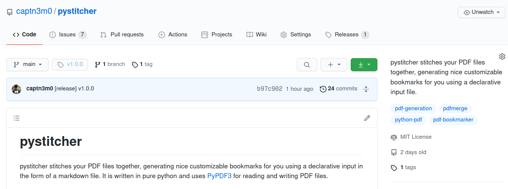

---
# try also 'default' to start simple
theme: seriph
# random image from a curated Unsplash collection by Anthony
# like them? see https://unsplash.com/collections/94734566/slidev
background: https://source.unsplash.com/collection/94734566/1920x1080
# apply any windi css classes to the current slide
class: 'text-center'
# https://sli.dev/custom/highlighters.html
highlighter: shiki
# some information about the slides, markdown enabled
info: |
  ## Slidev Starter Template
  Presentation slides for developers.

  Learn more at [Sli.dev](https://sli.dev)
---

# pystitcher

PDF stitcher for humans.

<!--
The last comment block of each slide will be treated as slide notes. It will be visible and editable in Presenter Mode along with the slide. [Read more in the docs](https://sli.dev/guide/syntax.html#notes)
-->

---

# Merging PDFs is easy

`pdftk 1.pdf 2.pdf cat output final.pdf`

---

# Except when its not

(Managing bookmarks)

```
pdftk 1.pdf 2.pdf cat output final.pdf
pdftk dump_data final.pdf > bookmarks.txt
# More code here to add more bookmarks
pdftk update_info_utf8 bookmarks.txt final.pdf final2.pdf
```

---

# [`pdfmerge`](https://github.com/metaist/pdfmerge)

- unmaintained :cry:

    pdfmerge [-o FILE] PATH[RULE[, RULE ...]]

Where RULE=

    [START][..][END][ROTATE]

Also no bookmarks :cry:

---
# What if?

```markdown
# Super Potato Book

# Volume 1

[Part 1](1.pdf)

# Volume 2

[Part 3](2.pdf)
```

---

# Show original PDFs

---

# Metadata!

```markdown
title: Super Jelly
Author: Nemo
keywords: potato, jelly
# Super Potato Book

# Volume 1

[Part 1](1.pdf)

# Volume 2

[Part 3](2.pdf)
```

---

# Existing Bookmarks?

```markdown
existing_bookmarks: remove
# Super Potato Book

# Volume 1

[Part 1](1.pdf)

# Volume 2

[Part 3](2.pdf)
```

---



---
# Existing Bookmarks?

```markdown
existing_bookmarks: flatten
# Super Potato Book

# Volume 1

[Part 1](1.pdf)

# Volume 2

[Part 3](2.pdf)
```

---



---

# Keep Bookmarks?

```markdown
existing_bookmarks: keep
# Super Potato Book

# Volume 1

[Part 1](1.pdf)

# Volume 2

[Part 3](2.pdf)
```

---



---

