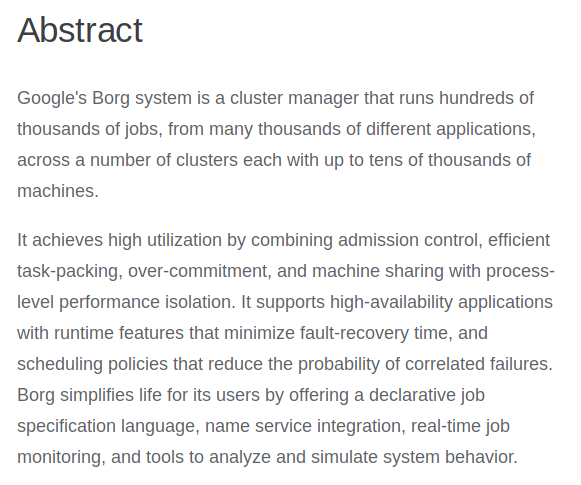
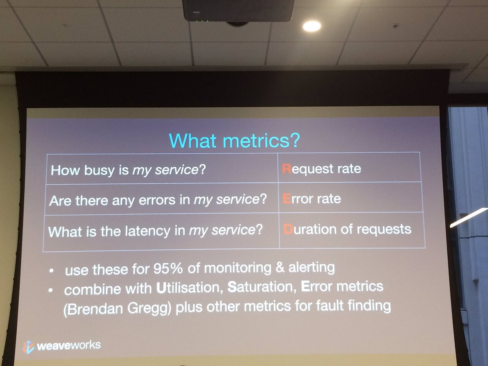
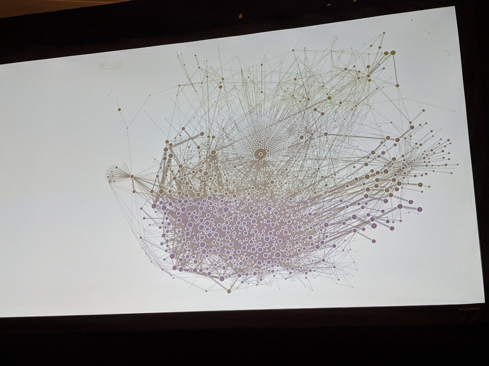

---
---

# <!--fit--> Tech 2019

_- nemo_

---

# <!-- fit -->2-feet-rule

---

# Caveats 🤷‍

-   Non-Exhaustive
-   Aligned to Razorpay

---

# For every Tech

1.  What is it?
2.  Why should you care?
3.  What can we use it for?

---

<!--  -->
<!--  -->

---

# serverless

## What is it?

If your application isn't called frequently enough, your computing resources can be brought up Just In Time.

---

## Why should you care?

-   Code runs instantly
-   You pay for what you run
-   Scaling is easier

---

## Sample Usecases

-   Any kind of Batch Jobs that take <15 minutes
-   A rarely visited website
-   If-this-then-that (Infrequent Trigger based Actions)
    -   When a user uploads a file ->
    -   When a user sends an email ->

---

## Limitations

-   Vendor-Lockins
-   Not all Languages

---

# blockchain

---

# what is it?

Techno-Libertarians's dream of removing central authorities from the world's economy, to only end up crashing it entirely.

---

# what is it?

blockchain is a verifiable distributed database that doesn't require trusted parties

---

---

---

---

---

# why should you care?

---

# really, should I care?

If you trust developers to write code that isn't buggy, and software developers to regulate finance better than the government does - Maybe?

---

---

# the google hype cycle

-   Map Reduce -> Apache Hadoop
-   BigTable -> Apache HBase
-   Chubby -> Apache Zookeeper
-   Spanner -> Cockroach DB
-   Borg -> kubernetes

---

# Borg

---

# What is it?

Large scale cluster management tool to help you run thousands of applications

---

# why should you care?

-   we run kubernetes and all of our services run on kubernetes
-   kubernetes is commoditization of the cloud (GCP/AWS :fist_raised:)
-   k8s advantage :tm:

---

# <!--fit-->logs v/s metrics v/s tracing

---

# logs

-   easiest
-   most verbose
-   no bird eye view

---

# metrics

-   most important
-   dimensions/cardinality of a metric

---

# what metrics

---

# USE

> For every resource, check utilization, saturation, and errors.

-   utilization: the average time that the resource was busy servicing work [2]
-   saturation: the degree to which the resource has extra work which it can't service, often queued
-   errors: the count of error events

---

# tracing

-   hardest
-   needs to be done well

---

---

# <!-- fit --> microservices

---

# microservices

aka: How to Trade Development complexity for Operational complexity
