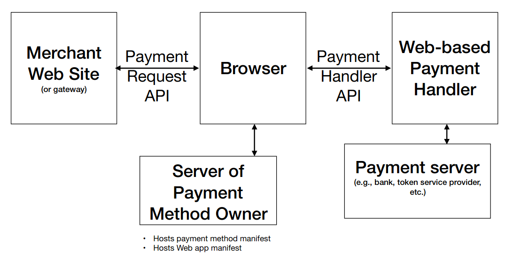
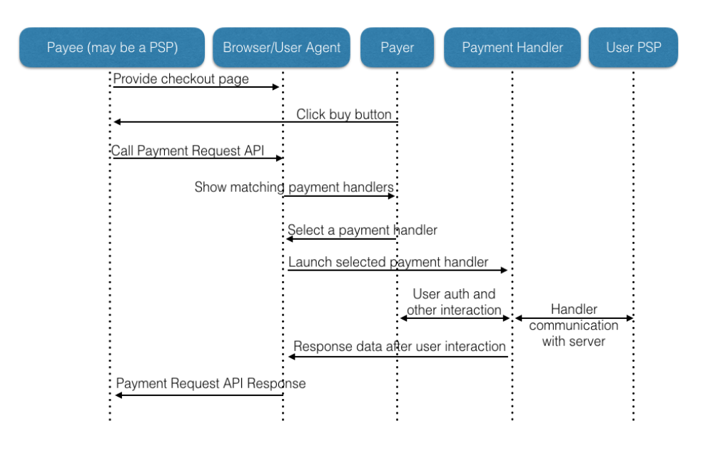

<!-- _class: lead -->
<!-- _paginate: false -->
# Web Payment APIs

\- nemo
(RFCs We Love, May 2020)


---

# `whoami`

- Nemo <me@captnemo.in>
- Tech/Security @ [Razorpay](https://razorpay.com)

---

# webpayments

<!-- Talk about all the innovations that have happened over the last 2 decades because of the internet and how none of them relate to money transfer (except for bitcoin)-->

>The goal is to create a safe, decentralized system and a set of open, patent and royalty-free specifications that allow people on the Web to send each other money as easily as they exchange instant messages and e-mail today.

---

# W3C

<!-- W3C is the internet-standards-body for the World Wide Web. You've likely used lots of their standards -->

- ActivityPub
- CGI
- CSS
- DOM
- HTML
- RDF
- SOAP
- SVG
- XHTML
- XML
- XPath

---

# [demo](https://paymentrequest.show/demo)

Before we start, let's do a quick demo of how it all comes together.

---

# why?

<!-- Bitcoin exists, and Amazon has been around for more than 2 decades, why do we need web payments? -->

- Make it easier to accept payments world-wide.
- Can we have "Payment negotiation", ala content-negotiation?
- Can we have privacy-preserving payment methods?
- Every webshop has its own checkout/cart implementation - can we standardize this?

---

# specifications*

<!-- There are 4 published standards (all in draft stage) and a few more auxiliary publications from W3C's Web Payments Working Group -->

- [Payment Request API](https://w3c.github.io/payment-request/)
<!-- : standardizes an API to allow merchants (i.e., Web sites selling physical or digital goods) to utilize one or more payment methods with minimal integration. User agents (e.g., browsers) facilitate the payment flow between merchant and user, mediating the user experience and providing consistency between different merchants and providers. -->
- [Payment Method Identifiers](https://w3c.github.io/payment-method-id/)
<!-- : defines the validation and (where applicable) registration of identifiers used for matching purposes by other W3C payments specifications. -->
- [Payment Handler API](https://w3c.github.io/payment-handler/)
<!-- :defines capabilities that enable Web applications to handle payment requests. The specification defines how Web-based payment handlers register their capabilities with the user agent, how the user agent communicates with them, and what information is exchanged. Note: Based on experience with the Payment Handler API, the Working Group is discussing creation of a new UI component where payments, authentication, and other activities can occur. This functionality would generalize some of the current payment-specific functionality of Payment Handler API. -->
- [Payment Method Manifest](https://w3c.github.io/payment-method-manifest/)
<!-- : allows the curators of a defined payment method or owners of a proprietary payment method to authorize (via a manifest file) which payment handlers may be used to fulfill the payment method. The scope of this work extends to all types of payment handlers, including native mobile apps and Web apps. -->

See [github.com/w3c/webpayments/wiki](https://github.com/w3c/webpayments/wiki) for a complete list

\* working drafts

---

# specifications*

- [Payment Request API](https://w3c.github.io/payment-request/): _how to initiate a payment_
- [Payment Method Identifiers](https://w3c.github.io/payment-method-id/): _what is a payment method?_
- [Payment Method Manifest](https://w3c.github.io/payment-method-manifest/): _definition of a payment method_
- [Payment Handler API](https://w3c.github.io/payment-handler/): _how a payment method is processed?_

<!-- - [Payment Request API](https://w3c.github.io/payment-request/) -->
<!-- : standardizes an API to allow merchants (i.e., Web sites selling physical or digital goods) to utilize one or more payment methods with minimal integration. User agents (e.g., browsers) facilitate the payment flow between merchant and user, mediating the user experience and providing consistency between different merchants and providers. -->
<!-- - [Payment Method Identifiers](https://w3c.github.io/payment-method-id/) -->
<!-- : defines the validation and (where applicable) registration of identifiers used for matching purposes by other W3C payments specifications. -->
<!-- - [Payment Handler API](https://w3c.github.io/payment-handler/) -->
<!-- :defines capabilities that enable Web applications to handle payment requests. The specification defines how Web-based payment handlers register their capabilities with the user agent, how the user agent communicates with them, and what information is exchanged. Note: Based on experience with the Payment Handler API, the Working Group is discussing creation of a new UI component where payments, authentication, and other activities can occur. This functionality would generalize some of the current payment-specific functionality of Payment Handler API. -->
<!-- - [Payment Method Manifest](https://w3c.github.io/payment-method-manifest/) -->
<!-- : allows the curators of a defined payment method or owners of a proprietary payment method to authorize (via a manifest file) which payment handlers may be used to fulfill the payment method. The scope of this work extends to all types of payment handlers, including native mobile apps and Web apps. -->

---

# Agenda

<!-- While removing propreitary stuff isn't a goal for the specs, it is a byproduct. -->

Try to understand how we can complete a payment entirely from within your browser _without relying on any proprietary APIs_ (as a processor/merchant), and yet _being compatible with any payment instrument_.

---

# Definitions

<!-- We'll be going bottomsup, and looking at the smallest building blocks first. -->

The **payment method**: the means that the payer uses to pay the payee (e.g., a basic card payment). They are uniquely identified via a **Payment Method Identifier** (PMI)

The **payment method provider** establishes the ecosystem to support that payment method.

The details of how to fulfill a payment request for a given payment method is an implementation detail of a **payment handler**, which is a Web application that can handle a request for payment on behalf of the user.

---

# Examples

**payment method**: Paytm Wallet Account, UPI, Card, Gift Card, Voucher Code, Bitcoin.

**Payment Method Identifier**: `https://paytm.com`, `https://npci.org.in/upi`, `basic-card`

**payment method provider**: `Razorpay`, `Stripe`, `PayPal`, `NPCI/UPI`, `your-bank-goes-here`

---

# ecosytem overview

---



---

# Flow

---




---

# [Payment Method Identifier](https://w3c.github.io/payment-method-id/)

<!-- You want a way to ensure that multiple payment processors work against the same initial payment request. Hence a need to standardize these identifiers. -->

- URL-based payment method identifier (say, `https://bitcoincore.org/` or `https://pay.wechat.com`).
- or a standardized payment method identifier (currently only `basic-card` is on the registry).

humanized: how to identify and categorize various payment methods?

---

# [Payment Method Manifest](https://w3c.github.io/payment-method-manifest/)

<!-- A payment method should be "discoverable", and that implies a manifest of some sort where a user-agent can find more details about the payment method -->

>allows the curators of a defined payment method or owners of a proprietary payment method to authorize (via a manifest file) which payment handlers may be used to fulfill the payment method.

humanized: defines the "how-to-process" action of a specific payment method. The one for `basic-card` is standardized in a [specification already](https://w3c.github.io/webpayments-methods-card/).

---

# How to get to the manifest?

```
GET / HTTP/2
Host: alicepay.com

HTTP/2 204
Link: </pay/payment-manifest.json>; rel="payment-method-manifest"
```

You can alternatively just redirect from your PMI URL, or serve the JSON directly on the PMI URL

---

# What's inside a Manifest?

A payment method manifest tells the user-agent "how to process payments for a particular method".

`URL: https://alicepay.com/pay/payment-manifest.json`

```json
{
  "default_applications": ["app/webappmanifest.json"],
  "supported_origins": [
    "https://bobpay.xyz",
    "https://alicepay.friendsofalice.example"
  ]
}
```

---

# Google Pay's Payment Method Manifest

`curl -A "AppleWebKit/1 Chromium/1 Chrome/1" https://pay.google.com/gp/p/payment_method_manifest.json`

```json
{
  "default_applications": ["https://pay.google.com/gp/p/web_manifest.json"],
  "supported_origins": ["https://pay.google.com"]
}
```

---

# what happens?

`user-agent` can go next to `https://alicepay.com/pay/app/webappmanifest.json` to *install* the AlicePay application.

`supported_origins` defines which origins can be trusted to install an application for this payment method.

---

# What's inside a Manifest (1)

```json
{
  //...
  "supported_origins": [
    "https://beta.alicepay.com",
    "https://bobpay.com"
  ]
}
```

A payment application hosted at either `alicepay.com`, `beta.alicepay.com`, or `bobpay.com` is now authorized for the payment method `https://alicepay.com`.

---

# What's inside a Manifest (2)

```json
{
  //...
  "supported_origins": "*"
}
```

any third party is allowed to support the payment method.

---

# Google Pay's Web Manifest

*Not part of the webpayments spec*

URL: `https://pay.google.com/gp/p/web_manifest.json`


```json
{
  "short_name": "Google Pay",
  "name": "Google Pay",
  "icons": [{
    "src": "https://www.gstatic.com/instantbuy/icons/gpay_24.png",
    "sizes": "24x24"
  },{
    "src": "https://www.gstatic.com/instantbuy/icons/gpay_32.png",
    "sizes": "32x32"
  }],
  "serviceworker": {
    "src": "/gp/p/service_worker.js",
    "use_cache": true
  }
}
```

---

# recap

So far, the user-agent has done the following:

1. seen a `payment-method` (we haven't gotten to how)
2. discovered the payment method manifest URL
3. parsed the payment method manifest to determine the webapp manifest URL
4. fetched the webapp manifest URL
5. _installed the payment method's application(s)_

The application installation is based on W3C's [Web App Manifest specification](https://www.w3.org/TR/appmanifest/).

---

# What's inside the Payment Handler?

A PaymentManager is an additional attribute to the `ServiceWorker` specification, which allows a piece of code to run/listen in background in your browser, even after the tab is closed.

```
PaymentManager {
  instruments = PaymentInstruments {
      delete(instrumentKey)
      get(instrumentKey)
      keys()
      has(instrumentKey);
      set(instrumentKey, PaymentInstrument details);
      clear();
  }
  userHint
}
```

---

# Payment Instrument

Defines what all different instruments a user might have registered against this method (Multiple wallets, bank accounts, cards etc).

```
PaymentInstrument {
  // Visa Card ending in **1214
  name;
  // Visa icon
  icons;
  // PMI
  method;
  // Can be used to restrict card usage by network for eg.
  capabilities;
}
```


---

# PaymentHandler API

A payment handler listens on the `PaymentRequestEvent`, and returns a `PaymentHandlerResponse` once done.

```
PaymentHandlerResponse {
  methodName // PMI
  details {}
  payerName;
  payerEmail;
  payerPhone;
  shippingAddress;
  shippingOption;
}
```

---


---

# Payment Handler

Each payment handler defines:

1. Steps to check if a payment can be made (listen to `CanMakePaymentEvent`)
2. Steps to respond to a payment request: (`PaymentRequestEvent`)
  >The structure of this object is specific to each payment method.
3. Steps for when a user changes payment method (optional) (`PaymentRequestDetailsUpdate`)
  >Steps that describe how to handle the user changing payment method or monetary instrument (e.g., from a debit card to a credit card)

---

# [Payment Request API](https://w3c.github.io/payment-request/)

PaymentRequest interface

```
id
show()
abort()
canMakePayment()
hasEnrolledInstrument()
shippingAddress
shippingType
onmerchantvalidation
onshippingaddresschange
shippingOption
onshippingoptionchange
onpaymentmethodchange
```

---

# Native Applications?

You can declare support for native applications via a few non-standardized changes to the payment method manifest:

```json
{
  "related_applications": [{
    "platform": "play",
    "id": "com.bobpay.app",
    "min_version": "1",
    "fingerprints": [{
      "type": "sha256_cert",
      "value": "92:5A:39:05:C5:B9:EA:BC:71:48:5F:F2"
    }],
    "url": "https://play.google.com/store/apps/details?id=com.bobpay.app"
  }]
}
```

---


# Native applications (2)

Instead of using service-workers now, your payment application can rely on platform-specific APIs for the same purpose. Android uses Intents, for eg.


---

# sample-indian-example

- Merchant Website: <https://flipkart.com>
- Payment Application: <https://icicibank.com> (and the corresponding iOS/Android apps)
- Payment Method: <https://rbi.org.in/neft>
- Payment Handler: The serviceworker installed when you first visited your bank website. Marked as usable across all websites.
- Payment Request: A browser redirect to a <https://pay.icicibank.com> with all required params for the payment. A few extra checks (enough balance etc) can be done by the handler before the request is complete.
- Payment Instrument: Each bank account with ICICI becomes a separate instrument.

---

# In the Wild

<!-- Is this available? -->

- Google Pay is already using Payments API to support cross-platform Payments, by declaring a new "https://google.com/pay" payment method.
- Apple Pay runs in browsers [using the Payment Request API](https://webkit.org/blog/8182/introducing-the-payment-request-api-for-apple-pay/).
- So does [Samsung Pay](https://medium.com/samsung-internet-dev/how-to-take-payments-on-the-web-with-the-payment-request-api-a523f6fc7c1f)
- Payment processors are adding support for it: [Stripe](https://stripe.com/docs/payment-request-api), [BrainTree](https://developers.braintreepayments.com/guides/payment-request/overview), [Worldline](https://blog.worldline.tech/2018/07/25/new-web-standards.html)
- Facebook implements it within their in-app browser for the Mobile SDK.

The "Payment Handler" for most of the above implementations is a close browser<>payment app coupling, with an application such as Samsung/Apple/Google Pay.

---

# Current Status

- All major browser implement Payment Request API to various degrees, primarily for the `basic-card` usecase.
- Payment Handler registration is only supported in Chrome.

---

# Future Scope

- Installing a payment app is clunky, maybe we can just install the service-worker directly.
- Lots of work happening towards standardization of non-card payments (such as SEPA, Tokenized Cards, credit-transfer).
- Getting the drafts published as a W3C recommendation

---

# Questions?

- Tweet to me [@captn3m0](https://twitter.com/captn3m0)
- Emails: <me@captnemo.in>

---

# References

- [Web Payments Working Group Blog](https://www.w3.org/blog/wpwg/)
- [Web Payments Working Group Charter](https://www.w3.org/Payments/WG/charter-201912.html)
- [Mozilla Developer Network docs](https://developer.mozilla.org/en-US/docs/Web/API/Payment_Request_API/Using_the_Payment_Request_API)
- [Developer information for Payment Request API](https://github.com/w3c/payment-request-info)
