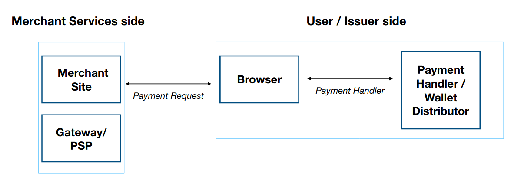

<!-- _class: lead -->

# Web Payment APIs

\- nemo
(RFCs We Love, May 2020)

---

# `whoami`

- Nemo <me@captnemo.in>
- Tech/Security @ [Razorpay](https://razorpay.com)

---

# webpayments

<!-- Talk about all the innovations that have happened over the last 2 decades because of the internet and how none of them relate to money transfer (except for bitcoin)-->

>The goal is to create a safe, decentralized system and a set of open, patent and royalty-free specifications that allow people on the Web to send each other money as easily as they exchange instant messages and e-mail today.

---

# W3C

- ActivityPub
- CGI
- CSS
- DOM
- HTML
- RDF
- SOAP
- SPARQL
- SVG
- XHTML
- XML
- XPath

---

# [demo](https://paymentrequest.show/demo)

Before we start, let's do a quick demo of how it all comes together.

---

# specifications*

- [Payment Request API](https://w3c.github.io/payment-request/)
<!-- : standardizes an API to allow merchants (i.e., Web sites selling physical or digital goods) to utilize one or more payment methods with minimal integration. User agents (e.g., browsers) facilitate the payment flow between merchant and user, mediating the user experience and providing consistency between different merchants and providers. -->
- [Payment Method Identifiers](https://w3c.github.io/payment-method-id/)
<!-- : defines the validation and (where applicable) registration of identifiers used for matching purposes by other W3C payments specifications. -->
- [Payment Handler API](https://w3c.github.io/payment-handler/)
<!-- :defines capabilities that enable Web applications to handle payment requests. The specification defines how Web-based payment handlers register their capabilities with the user agent, how the user agent communicates with them, and what information is exchanged. Note: Based on experience with the Payment Handler API, the Working Group is discussing creation of a new UI component where payments, authentication, and other activities can occur. This functionality would generalize some of the current payment-specific functionality of Payment Handler API. -->
- [Payment Method Manifest](https://w3c.github.io/payment-method-manifest/)
<!-- : allows the curators of a defined payment method or owners of a proprietary payment method to authorize (via a manifest file) which payment handlers may be used to fulfill the payment method. The scope of this work extends to all types of payment handlers, including native mobile apps and Web apps. -->

See [github.com/w3c/webpayments/wiki](https://github.com/w3c/webpayments/wiki) for a complete list

\* working drafts

---

# specifications*

- [Payment Request API](https://w3c.github.io/payment-request/): _how to initiate a payment_
- [Payment Method Identifiers](https://w3c.github.io/payment-method-id/): _what is a payment method?_
- [Payment Method Manifest](https://w3c.github.io/payment-method-manifest/): _definition of a payment method_
- [Payment Handler API](https://w3c.github.io/payment-handler/): _how a payment method is processed?_
---

# the talk

Try to understand how we can complete a payment entirely from within your browser _without relying on any proprietary APIs_ (as a processor/merchant), and yet _being compatible with any payment instrument_.

---

# definitions

The **payment method**: the means that the payer uses to pay the payee (e.g., a basic card payment). They are uniquely identified via a **Payment Method Identifier** (PMI)

The **payment method provider** establishes the ecosystem to support that payment method.

The details of how to fulfill a payment request for a given payment method is an implementation detail of a **payment handler**, which is a Web application that can handle a request for payment on behalf of the user.

---

# examples

**payment method**: Paytm Wallet Account, UPI, Card, Gift Card, Voucher Code, Bitcoin.

**Payment Method Identifier**: `https://paytm.com`, `https://npci.org.in/upi`, `basic-card`

**payment method provider**: `Razorpay`, `Stripe`, `PayPal`, `NPCI/UPI`, `your-bank-goes-here`

---

# [Payment Method Identifier](https://w3c.github.io/payment-method-id/)

- URL-based payment method identifier (say, `https://bitcoincore.org/` or `https://pay.wechat.com`).
- or a standardized payment method identifier (currently only `basic-card` is on the registry).

humanized: how to identify and categorize various payment methods?

---

# [Payment Method Manifest](https://w3c.github.io/payment-method-manifest/)

>allows the curators of a defined payment method or owners of a proprietary payment method to authorize (via a manifest file) which payment handlers may be used to fulfill the payment method.

humanized: defines the schema of a specific payment method. The one for `basic-card` is standardized in a [specification already](https://w3c.github.io/webpayments-methods-card/).

---

# How to get to the manifest?

```
GET / HTTP/2
Host: alicepay.com

HTTP/2 204
Link: </pay/payment-manifest.json>; rel="payment-method-manifest"
```

---

# What's inside a Manifest?

A payment method manifest tells the user-agent "how to process payments for a particular method".

`URL: https://alicepay.com/pay/payment-manifest.json`

```json
{
  "default_applications": ["app/webappmanifest.json"],
  "supported_origins": [
    "https://bobpay.xyz",
    "https://alicepay.friendsofalice.example"
  ]
}
```

user-agent can go next to `https://alicepay.com/pay/app/webappmanifest.json` to *install* the AlicePay application.

`supported_origins` defines which origins can be trusted to install an application for this payment method.

---

# What's inside a Manifest (1)

```json
{
  //...
  "supported_origins": [
    "https://beta.alicepay.com",
    "https://bobpay.com"
  ]
}
```

A payment application hosted at either `alicepay.com`, `beta.alicepay.com`, or `bobpay.com` is now authorized for the payment method `https://alicepay.com`.

---

# What's inside a Manifest (2)

```json
{
  //...
  "supported_origins": "*"
}
```

any third party is allowed to support the payment method.

---

# recap

So far, the user-agent has done the following:

1. seen a `payment-method` (we haven't gotten to how)
2. discovered the payment method manifest URL
3. parsed the payment method manifest to determine the webapp manifest URL
4. fetched the webapp manifest URL
5. _installed the payment method's application(s)_

The application installation is based on W3C's [Web App Manifest specification](https://www.w3.org/TR/appmanifest/).

---

# Payment Handler

Each payment handler defines:

1. Steps to check if a payment can be made:
2. Steps to respond to a payment request:
  >The structure of this object is specific to each payment method.
3. Steps for when a user changes payment method (optional)
  >Steps that describe how to handle the user changing payment method or monetary instrument (e.g., from a debit card to a credit card)

---

# overview

TODO: Move this higher?



[ref](https://www.w3.org/2018/Talks/ij_payments_20181009/w3c.pdf)

---

# [Payment Request API](https://w3c.github.io/payment-request/)


---

# Future Scope

- Installing a payment app is clunky, maybe we can just install the service-worker directly.

---

# references

- [Web Payments Working Group Blog](https://www.w3.org/blog/wpwg/)
- [ Web Payments Working Group Charter ](https://www.w3.org/Payments/WG/charter-201912.html)
